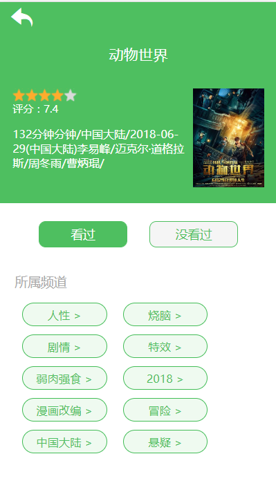

## 技术栈
   react + react-router + redux + axios+ async+ 阿里字体图标
<br>
由于没有去阿里部署，所以用的是豆瓣api。

## 参与开发
<br>
更多项目请关注 https://github.com/fanfan1993
<br>

## 运行
```
  - npm install  
  
  - npm start (运行项目)

  - npm run build (打包项目)
  ```
## Table of Contents

  - [npm start](#npm-start)
  - [npm test](#npm-test)
  - [npm run build](#npm-run-build)
  - [npm run eject](#npm-run-eject)
  

  ## 页面目录
After creation, your project should look like this:

```
my-app/
  README.md
  node_modules/
  package.json
  public/
    index.html
    favicon.ico
  src/
    App.css
    App.js
    App.test.js
    index.css
    index.js
    logo.svg
```
## 页面效果
##### 页面显示





